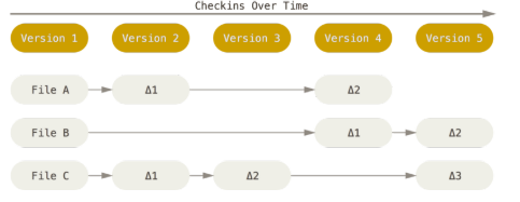
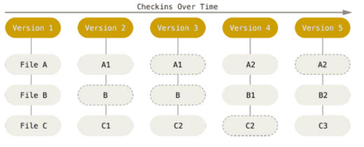
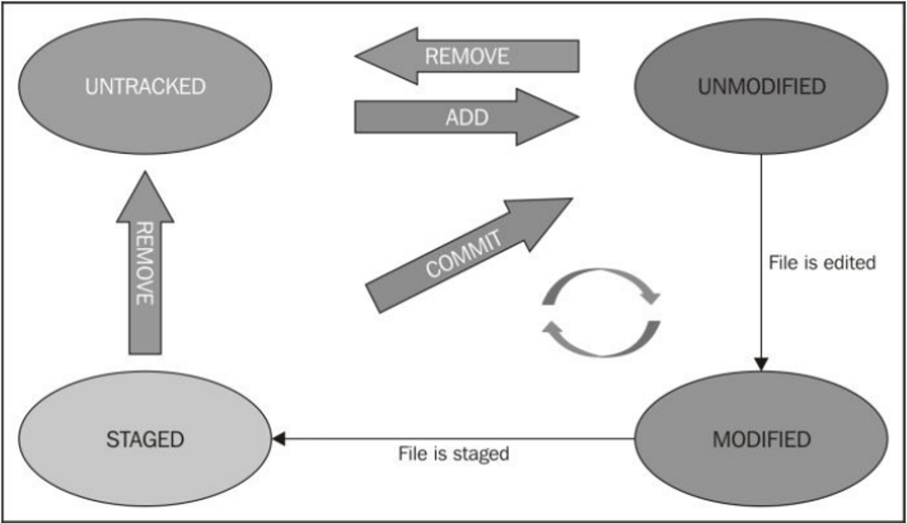

## About Version Control

A version control system or VCS on a local computer contains a database. This set of versions
can be managed by means of a file with different timestamps, however, it has the disadvantage 
of complicating the workflow externally to the local computer since there is no view or control
of other users.

### Why would version control matter to me?

The version control method chosen by many people is to 
copy files to another directory (maybe a timestamped directory, if 
you're smart). This approach is very common because it is so simple,
but it is also incredibly error-prone. It's easy to forget what 
directory you are in and accidentally write to the wrong file or copy
files that you don't want.

### Types of control systems

#### Local VCS

#### Centralized VCS

A **centralized version control system**, has a central server that maintains an original copy,
allowing local copies to be made to be able to modify the file independently. However, if that
server goes down, you will lose access to core versions. Obtaining only individual files 
previously saved locally.

#### Distributed VCS

A **distributed version control system**, on the other hand, allows a server which has
practically the same information as the local versions of each individual computer. If the 
same happens as in the central VCS, and we lose the server, the local data can be reestablished
in the central server to continue with the project. The drawback of these two types of control
(VCS and distributed) is the workflow that coordinates how the project will be developed.

### And then Git

Some goals that Git was born with are:
- Speed
- Simple design
- Strong support for non-linear development (thousands of parallel branches)
- Fully distributed
- Able to handle large projects like Linux kernel efficiently (speed and data size)

Git was born out of a Linux dispute, because the VCS that was used to maintain the 
kernel code was proprietary and when there were differences they took away its financial
support. So Linus Torvalds started to making its own VCS (Git).

#### Getting started

**Install Git**

1. At the link: <https://git-scm.com/>
   We can find the documentation and information needed to properly use Git. Also, we find the installation package in the Downloads section where we will choose the Operating System corresponding to our device.
2. We continue with the necessary steps to install it and finish the installation.

**About GitHub**

GitHub is a Social Network made to be used as a platform to discuss, share, review code with other
people around the world, it uses Git under the hood, so to understand how it works it's good to start
by using the Git VCS.

#### Git Basics

**Snapshots, not differences**

The main difference between Git and any other VCS (including Subversion and friends) is the way
that Git thinks about your data. Conceptually, most other systems store information as a 
file-based changelist. These systems (CVS, Subversion, Perforce, Bazaar, etc.) consider the
information they save as a set of files and the changes made to each file over time.

Git doesn't think of or store your data in this way. Instead, Git thinks of your data more 
like a set of snapshots of a miniature filesystem. Every time you commit or save the state
of your project in Git, it basically takes a picture of what all your files look like at the
moment and stores a reference to that snapshot. To be efficient, if the files haven't changed, 
Git doesn't store the file again, just a link to the previous identical file that it has already
stored. Git thinks of your data more like a snapshot stream.

- _Nearly Every Operation Is Local:_
Most operations in Git only need local files and resources to function; generally, no 
information is needed from another computer on your network.

- _Git Has Integrity:_
Everything in Git is "digested" for verification before being stored and then referenced
by that checksum. This means that it is impossible to change the content of any file or
directory without Git knowing about it.

- _Git Generally Only Adds Data:_
When you perform actions in Git, almost all of them just add data to the Git database. 
It is difficult to get the system to do something that cannot be undone or to erase data in 
some way.

### Working with the repository

#### The three areas

Git has 3 areas in where your file could be:

- Your working directory
- Staging area 
- Your Git repo

The files can be in different states for the Git VCS, and depending on the operations performed
can change the area and the status.

### First setup

#### Configuration Hierarchy

Git has a hierarchy for the configuration, you can modify all of them, the hierarchy is from
minor to mayor priority:

**Command: _git config_**

1. **System** [path]/etc/gitconfig or C:\ProgramData\Git\config:

   _--system_
   
   _git config -f <file>_

2. **User** ~/.gitconfig or ~/.config/git/config or $HOME:

   _--global_

3. **Repository** .git/config :

   _--local_

To see all settings:

**_git config –list –show-origin_**

**The hierarchy:**

1. File [path]/etc/gitconfig: 
Contains values applied to each user on the system and all their repositories. If you pass 
the _--system_ option to _git config_, it reads and writes from this file specifically. 
Since this is a system configuration file, you will need administrator or super-user 
privileges to make changes to it.

2. ~/.gitconfig or ~/.config/git/config file: 
Settings specific to you, the user. You can make Git read and write to this file 
specifically by passing the --global option, and this affects all repositories you work 
with on your system.

3. Configuration file in the Git directory (ie .git/config) of whatever repository you are currently using: 
Specific to that single repository. You can force Git to read and write to this file with
the _--local_ option, but that's actually the default. Unsurprisingly, it must be located 
somewhere in a Git repository for this option to work properly. Each level overrides the 
values of the previous level, so the values in .git/config surpass those in [path]/etc/gitconfig.

**Your identity**

The basic information you need to provide to Git to use it is your name and your e-mail:

**_git config --global user.name "John Doe"_**

**_git config --global user.email johndoe@example.com_**

You can also specify other things, like your GPG key, your default branch name, the default 
signing status for the commits, etc.

**Your editor**

Another important thing you need to specify is your default editor, e.g:

**_git config --global core.editor emacs_**

**_git config --global core.editor "'C:/Program Files/Notepad++/notepad++.exe' -multiInst -notabbar -nosession -noPlugin"_**
