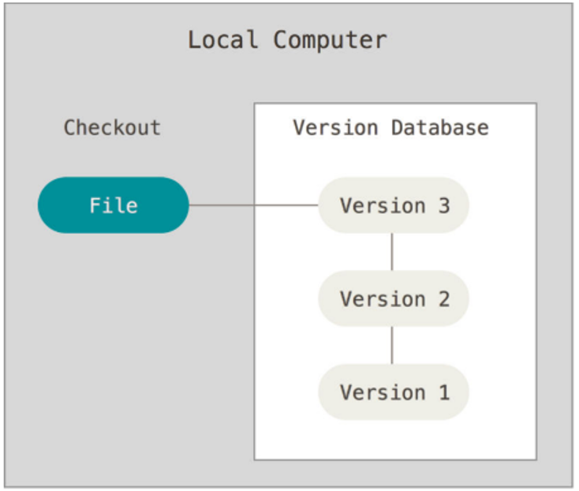

## About Version Control

A version control system or VCS on a local computer contains a database. This set of versions
can be managed by means of a file with different timestamps, however, it has the disadvantage 
of complicating the workflow externally to the local computer since there is no view or control
of other users.

### Why would version control matter to me?

The version control method chosen by many people is to 
copy files to another directory (maybe a timestamped directory, if 
you're smart). This approach is very common because it is so simple,
but it is also incredibly error-prone. It's easy to forget what 
directory you are in and accidentally write to the wrong file or copy
files that you don't want.

### Types of control systems

#### Local VCS

#### Centralized VCS

A **centralized version control system**, has a central server that maintains an original copy,
allowing local copies to be made to be able to modify the file independently. However, if that
server goes down, you will lose access to core versions. Obtaining only individual files 
previously saved locally.

#### Distributed VCS

A **distributed version control system**, on the other hand, allows a server which has
practically the same information as the local versions of each individual computer. If the 
same happens as in the central VCS, and we lose the server, the local data can be reestablished
in the central server to continue with the project. The drawback of these two types of control
(VCS and distributed) is the workflow that coordinates how the project will be developed.
