## Git Branching

To really understand how Git branches, we need to take a step back and examine how Git
stores its data. As you may recall from the [_Git basics_](Git_Basics.md) section, Git 
doesn't store data as a series of change or difference sets, but as a series of snapshots.

Commit pointing to a snapshot and the detail of its tree:

This is how our branch and its commits would look:

### Creating new branches

To create new branches within the repository we will use:

**_git branch <branchname>_**

Every branch in Git it's a pointer to a commit: 

The way that Git knows which branch it's the current working area is by the HEAD pointer:

How to know where we have the head?

**_git log --oneline --decorate_**

### Changing branches

To switch between branches we will use:

**_git checkout <branchname>_**

If we run the previous command, our HEAD pinter would look like:

If we make a commit in the new branch:

If we return to the master branch and make a commit:

By default, _git log_ will only show commit history under the branch it is on. To display the 
commit history for the desired branch, you must explicitly specify it: _git log <branchname>_. 
To show all branches, add _--all_ to your _git log_ command.

If we want to change to a branch and create it in the same instruction we will do it
with _git checkout -b <newbranchname>_.

From Git version 2.23 onwards, you can use _git switch_ instead of _git checkout_ to:

• Switch to an existing branch: _git switch <existingbranch>_

• Create a new branch and switch to it: _git switch -c <newbranchname>_.
The _-c_ flag means create, you can also use the full flag: _--create_

• Go back to your previously verified branch: _git switch -_

### Branching and Merging

To list our branches:

**_git branch -a_**

#### Fast-forward

If the commits being merged are direct predecessors of the current branch's HEAD pointer, 
Git simplifies things by performing a so-called fast-forward merge. This fast-forward merge 
simply moves the HEAD pointer from the current branch to the last commit of the branch 
being merged. This process is described in the following diagram. The first image assumes 
that the master branch is checked out, and you want to merge the changes from the branch
labeled branch into your master branch. Each commitment points to its predecessor (parent).

#### Three-way Merge

This looks a bit different from the hotfix combination you did earlier. In this case, his 
developmental history has deferred from some point earlier. Because the commit on the branch 
you are on is not a direct ancestor of the branch you are merging into, Git has to do a bit 
of work. In this case, Git performs a simple three-way join, using the two snapshots pointed 
to by the branch tips and the common ancestor of both.

In order to force git to use the three-way strategy:

**_git merge --no-ff_**

#### Other Strategies

There are two types of strategies; ours and theirs:

**_git merge -s ours test_**

**_git merge -s theirs test_**

The result of _ours_ strategy is that everything in the merged branch will be ignored. 
_Theirs_ strategy will do the exact opposite.

For example, if we try to push our modifications in index.html, and Git tells us that
something is wrong because Jim pushed the useless changes in index.html earlier, you can 
apply ours strategy, which will override the changes made by Jim and use your file .

If Jim made the same changes as you, but in a better way, you can apply theirs strategy. 
It will remove your changes to use the file provided by Jim.

One strategy remains; this is the recursive strategy. Allows you to specify the _–x_ parameter
to prefer your local/remote changes if there are conflicts of the two merged branches:

**_git merge -s recursive -x ours test_**

**_git merge -s recursive -x theirs test_**

#### Rebase

As we have just seen, the merge command combines the changes of two branches. The _git rebase_ 
command will take the changes from the first branch and apply them to the other branch.

Rebase command don't merge commits!

Let's see an example:

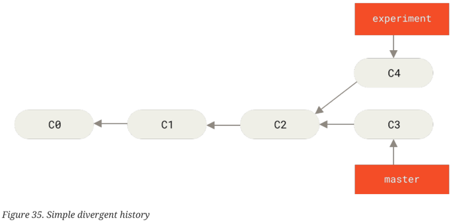

This operation works by going to the common ancestor of the two branches (in which you are and 
in which you are passing), obtaining the difference introduced by each confirmation of the 
branch in which you are, saving those differences in temporary files, restoring the current 
branch to the same commit as the branch you are resetting on and finally applying each change 
in turn.

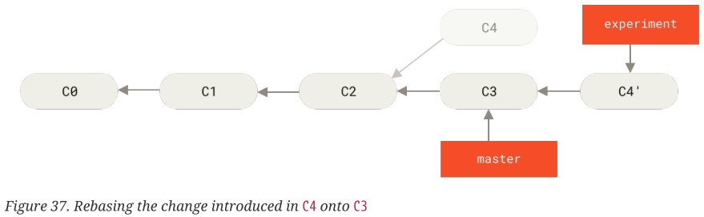

**More Interesting Rebase**

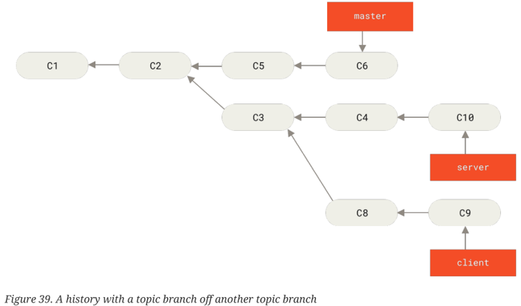

Suppose you decide that you want to merge client-side changes into your main line for a release,
but you want to postpone server-side changes until further testing. You can take the changes 
on the client that are not on the server (C8 and C9) and reproduce them in your master branch 
using the _--onto_ option of _git rebase_:

**_git rebase --onto master server client_**

This basically says: "Take the client branch, discover the patches as it was detached from
the server branch, and replay these patches on the client branch as if it were based directly
on the master branch." It is a bit complex, but the result is quite good.

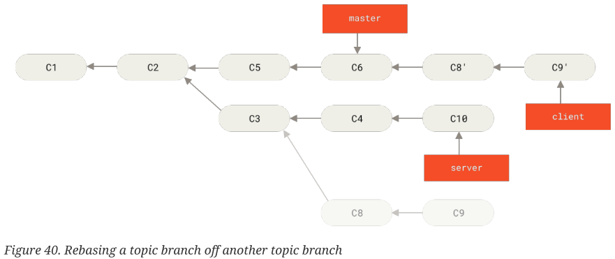

    git checkout master
    git merge client

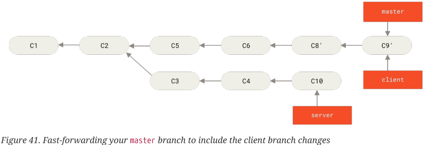

    git rebase master server

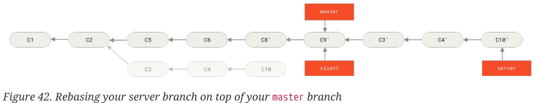

Finally, we have a linear history:

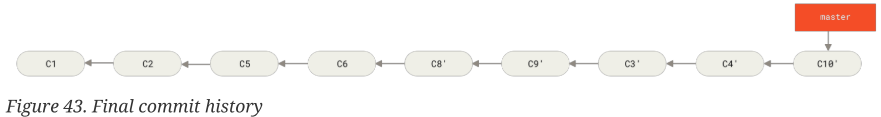

**The perils of rebasing**

Ah, but the joy of passing is not without its drawbacks, this can be summed up in a single line:

**DO NOT** replace commits that exist outside your repository and that people may have based their
work on.

If you follow that guide, you will be fine. If you don't, people will hate you and your friends
and family will despise you.

When you pass, you are abandoning existing commits and creating new ones that are similar
but different. If you push commits somewhere and others download them and base work on them,
and then rewrite those commits with git rebase and upload them again, your collaborators will 
have to re-merge their work and things will get complicated when you try to retry. put their
work in yours.

Let's look at an example of how the relining work you've released can cause problems. Suppose 
you clone from a central server and then work with that. Your commit history looks like this:

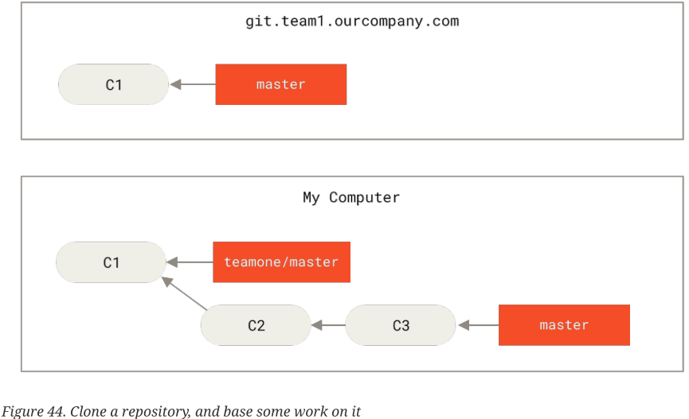

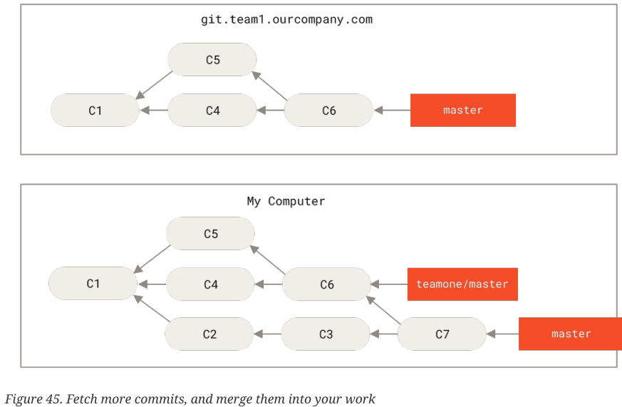

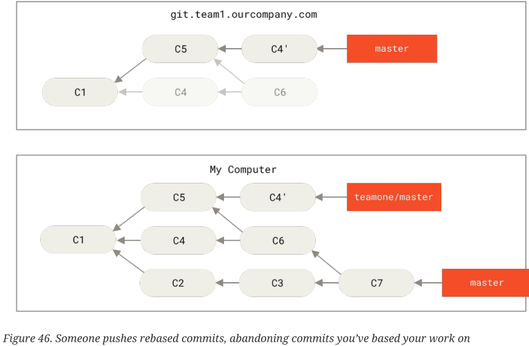

Now they are both in a bind. If you do a git pull, you will create a merge commit that includes 
both lines of history, and your repository will look like this:

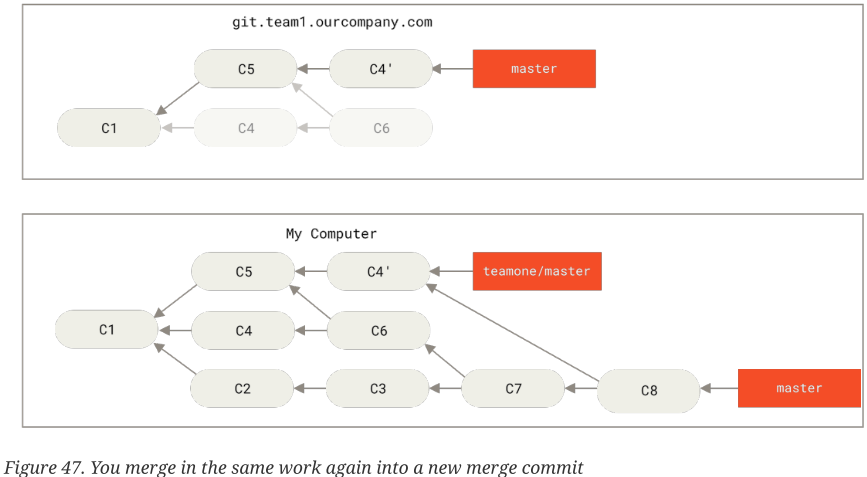

If you run a git log when your history looks like this, you will see two commits that have the
same author, date, and message, which will be confusing. Also, if you send this history back 
to the server, you will push all those modified commits back to the core server, which can 
further confuse people. It's pretty safe to assume that the other developer doesn't want C4
and C6 to be in the history; that is why they were exceeded in the first place.

#### Squash

"Squash" in Git means to combine multiple commits into one. You can do this at any time 
(using Git's "Interactive Rebase" feature), although this is usually done when merging 
branches.

Note that there is **no separate git squash command**. Instead, squashing is more of an option
when performing other Git commands like interactive _rebase_ or _merge_.

**How to squash your commits**

* **Interactive Rebase:**

    You can manually squash your commits at any time using Git's "Interactive rebase" feature.

    **_git rebase -i HEAD ~ [number_of_commits_to_squash]_**

* **Pull Requests:**

    This strategy, which uses squash when merging, is often used when closing a pull request. 
Code hosting platforms like GitHub, GitLab, or Bitbucket support this as an option when 
merging a pull request.

  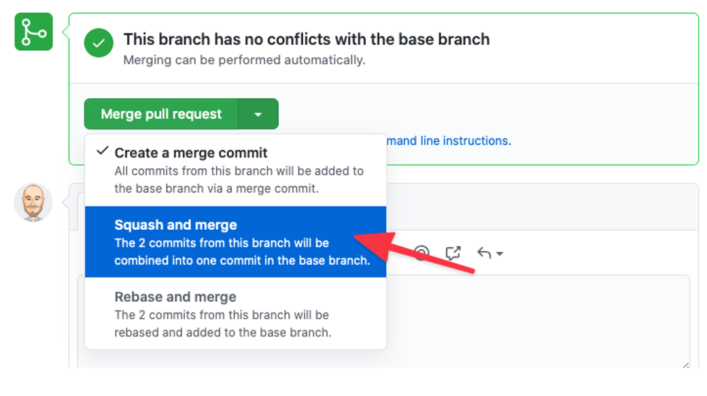

* **Merge:**

    The effect is very similar to what we have discussed before:
all changes will be merged as with a normal merge, but by using the _--squash_ option, instead
of automatically creating a merge commit, you will be left with local changes to your working
copy which you can then commit yourself.

    **_git merge --squash <branch>_**

    **_git commit_**

  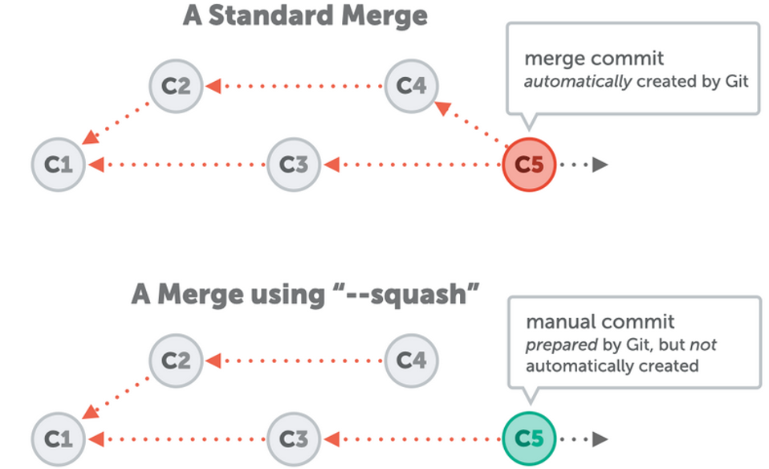

#### Cherry-pick

Cherry-pick is a powerful command that allows arbitrary Git commits to be picked by reference 
and added to the current working _HEAD_. Running cherry-pick is the act of picking a commit from 
one branch and applying it to another.

_git cherry-pick_ can be useful for undoing changes. For example, suppose a commit is accidentally
applied to the wrong branch. You can switch to the correct branch and cherry-pick on the 
commit to apply it where it belongs.

**_git cherry-pick <commit-hash>_** will apply changes made to an existing commit to another branch,
while registering a new commit. Essentially, you can copy commits from one branch to another.

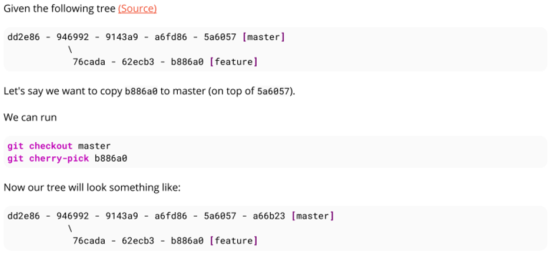

Note that cherry-pick will only pick up the changes in that commit (**b886a0** in this case),
not all the changes in the features branch (for this you will have to use rebase or merge).

**_git cherry-pick <commit-A> ^ .. <commit-B>_** will place commit A and all commits up to and
including B at the top of the current branch.

**_git cherry-pick <commit-A> .. <commit-B>_** will place each commit after A up to and including
B at the top of the currently pulled branch.

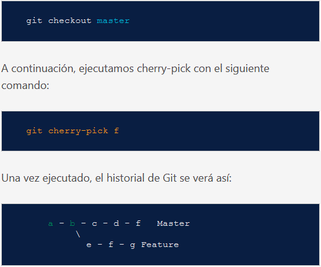