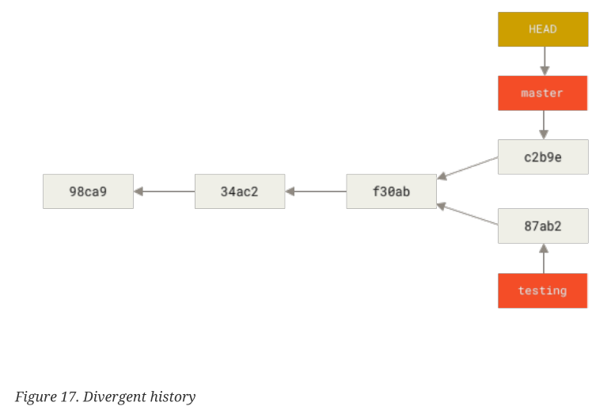

## Git Branching

To really understand how Git branches, we need to take a step back and examine how Git
stores its data. As you may recall from the [_Git basics_](Git_Basics.md) section, Git 
doesn't store data as a series of change or difference sets, but as a series of snapshots.

Commit pointing to a snapshot and the detail of its tree:

This is how our branch and its commits would look:

### Creating new branches

To create new branches within the repository we will use:

**_git branch <branchname>_**

Every branch in Git it's a pointer to a commit: 

The way that Git knows which branch it's the current working area is by the HEAD pointer:

How to know where we have the head?

**_git log --oneline --decorate_**

### Changing branches

To switch between branches we will use:

**_git checkout <branchname>_**

If we run the previous command, our HEAD pinter would look like:

If we make a commit in the new branch:

If we return to the master branch and make a commit:

By default, _git log_ will only show commit history under the branch it is on. To display the 
commit history for the desired branch, you must explicitly specify it: _git log <branchname>_. 
To show all branches, add _--all_ to your _git log_ command.

If we want to change to a branch and create it in the same instruction we will do it
with _git checkout -b <newbranchname>_.

From Git version 2.23 onwards, you can use _git switch_ instead of _git checkout_ to:

• Switch to an existing branch: _git switch <existingbranch>_

• Create a new branch and switch to it: _git switch -c <newbranchname>_.
The _-c_ flag means create, you can also use the full flag: _--create_

• Go back to your previously verified branch: _git switch -_

### Branching and Merging

To list our branches:

**_git branch -a_**

#### Fast-forward

If the commits being merged are direct predecessors of the current branch's HEAD pointer, 
Git simplifies things by performing a so-called fast-forward merge. This fast-forward merge 
simply moves the HEAD pointer from the current branch to the last commit of the branch 
being merged. This process is described in the following diagram. The first image assumes 
that the master branch is checked out, and you want to merge the changes from the branch
labeled branch into your master branch. Each commitment points to its predecessor (parent).

#### Three-way Merge

This looks a bit different from the hotfix combination you did earlier. In this case, his 
developmental history has deferred from some point earlier. Because the commit on the branch 
you are on is not a direct ancestor of the branch you are merging into, Git has to do a bit 
of work. In this case, Git performs a simple three-way join, using the two snapshots pointed 
to by the branch tips and the common ancestor of both.

In order to force git to use the three-way strategy:

**_git merge --no-ff_**

#### Other Strategies

There are two types of strategies; ours and theirs:

**_git merge -s ours test_**

**_git merge -s theirs test_**

The result of _ours_ strategy is that everything in the merged branch will be ignored. 
_Theirs_ strategy will do the exact opposite.

For example, if we try to push our modifications in index.html, and Git tells us that
something is wrong because Jim pushed the useless changes in index.html earlier, you can 
apply ours strategy, which will override the changes made by Jim and use your file .

If Jim made the same changes as you, but in a better way, you can apply theirs strategy. 
It will remove your changes to use the file provided by Jim.

One strategy remains; this is the recursive strategy. Allows you to specify the _–x_ parameter
to prefer your local/remote changes if there are conflicts of the two merged branches:

**_git merge -s recursive -x ours test_**

**_git merge -s recursive -x theirs test_**

#### Rebase

**More Interesting Rebase**

**The perils of rebasing**

#### Squash

**How to squash your commits**

#### Cherry-pick
