## Git Internals

### Plumbing and porcelain

This course mainly covers how to use Git with 30 or more subcommands like checkout, branch,
remote, etc. But because Git was initially a toolkit for a version control system rather than 
a full, easy-to-use VCS, it has a number of subcommands that do low-level work and were designed 
to be chained UNIX-style or to be called from scripts. These commands are generally referred to 
as Git "plumbing" commands, while the easier to use commands are called "porcelain" commands.

#### Git Init

When you run git init on a new or existing directory, Git creates the _.git_ directory, which 
is where almost everything that Git stores and manipulates is located.

This is what a newly initialized _.git_ directory looks like:

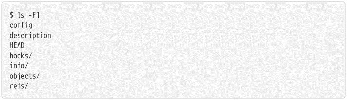

The description file is only used by the GitWeb program, so don't worry. The configuration file 
contains your project-specific configuration options, and the info directory maintains a global
exclude file for ignored patterns that you don't want to track in a _.gitignore_ file. The _hooks_ 
directory contains the client or server-side hook scripts, which are described in detail in 
Git Hooks.

This leaves four important entries: the _HEAD_ and index files (yet to be created), and the 
object and reference directories. These are the core parts of Git. The _objects_ directory stores
all the contents of your database, the _refs_ directory stores pointers to commit objects in that
data (branches, labels, remotes, and more), the _HEAD_ file points to the branch that you have
currently checked out, and the _index_ file is where Git stores your staging area information. 
You will now look at each of these sections in detail to see how Git works.

### Git Objects

#### Blob Object

Git is a content-addressable filesystem. Great. What does that mean? It means that at the core
of Git there is a simple key-value data store. What this means is that you can push any type of
content into a Git repository, for which Git will return you a unique key that you can later 
use to retrieve that content.

As a demonstration, let's look at the _git hash-object_ plumbing command, which takes some data, 
stores it in your _.git/objects_ directory (the object database), and returns you the unique
key which now refers to that data object .

First, initialize a new Git repository and check that there is (unsurprisingly) nothing in the
object directory:

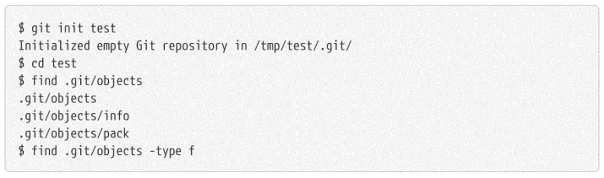

Git has initialized the object directory and created subdirectories of information and packages 
in it, but there are no regular files. Now, let's use _git hash-object_ to create a new data 
object and store it manually in your new Git database:

In its simplest form, the git hash-object would take the content you gave it and simply return
the unique key that would be used to store it in your Git database. The _-w_ option tells the 
command not to just return the key, but to write that object to the database. Finally, the
_--stdin_ option tells _git hash-object_ to get the content to be processed from stdin; otherwise 
the command would expect a filename argument at the end of the command that contains the content
to be used.

The output of the above command is a 40-character checksum hash. This is the SHA-1 hash a
checksum of the content you're storing plus a header, which you'll learn about in a moment. Now
you can see how Git has stored your data:

If you re-examine your object directory, you can see that it now contains a file for that new 
content. This is how Git stores content initially, as a single file per content piece, named
with the SHA-1 checksum of the content and its header. **The subdirectory is named with the 
first 2 characters of SHA-1 and the file name is the remaining 38 characters.**

Once you have content in your object database, you can examine that content with the _git cat-file_
command. This command is a kind of Swiss army knife for inspecting Git objects. Passing _-p_ to 
_cat-file_ tells the command to first find out the content type and then display it appropriately:

Now, you can add content to Git and check it out again. You can also do this with content in
files. For example, you can perform a simple version control on a file. First, create a new 
file and save its content to your database:

Then write new content to the file and save it again:

Your object database now contains both versions of this new file (and the first content
you stored there):

At this point, you can delete your local copy of that test.txt file, then use Git to retrieve, 
from the object database, the first version you saved:

or the second version:

But remembering the SHA-1 key for each version of your file is not practical; Also, you are 
not storing the filename on your system, just the content. This type of object is called a 
blob. You can have Git tell you the object type of any object in Git, given its SHA-1 key, 
with _git cat-file -t_:

#### Tree Object

The next type of Git object we will examine is the tree, which solves the problem of storing
the file name and also allows you to store a group of files together. Git stores content in
a similar way to a UNIX filesystem, but a bit simplified. All content is stored as tree and
blob objects, with trees corresponding to UNIX directory entries and blobs corresponding more 
or less to inodes or file content. A single tree object contains one or more entries, each of
which is the SHA-1 hash of a blob or subtree with its associated mode, type, and filename. 
For example, the most recent tree for a project might look like this:

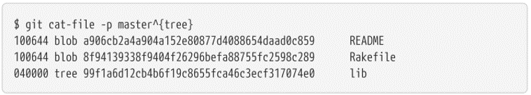

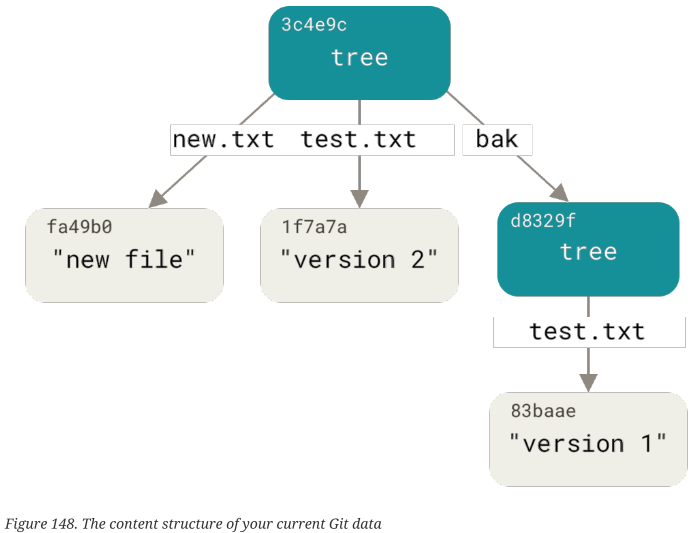

#### Commit Object

You now have three trees representing the different snapshots in your project that you want
to track, but the above problem persists; you have to remember the three SHA-1 values in
order to retrieve the snapshots. You also have no information about who saved the snapshots,
when they were saved, or why they were saved. This is the basic information that the commit
object stores.

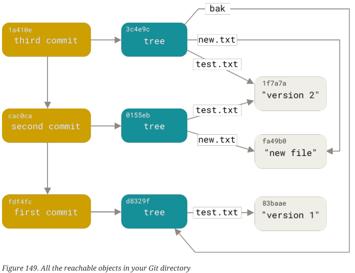

#### Git References

If you were interested in seeing your repository history accessible from commit, for
example _1a410e_, you could run something like _git log 1a410e_ to show that history, but
you would still have to remember that _1a410e_ is the commit you want to use as a starting
point of that story. Instead, it would be easier if you had a file where you could store
that SHA-1 value with a simple name so that you can use that simple name instead of the
raw SHA-1 value.

In Git, these simple names are called "references" or "refs"; You can find the files that 
contain those SHA-1 values in the _.git/refs_ directory. In the current project, this
directory does not contain files, but contains a simple structure:

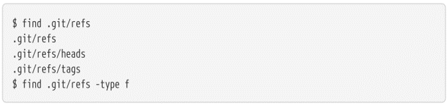

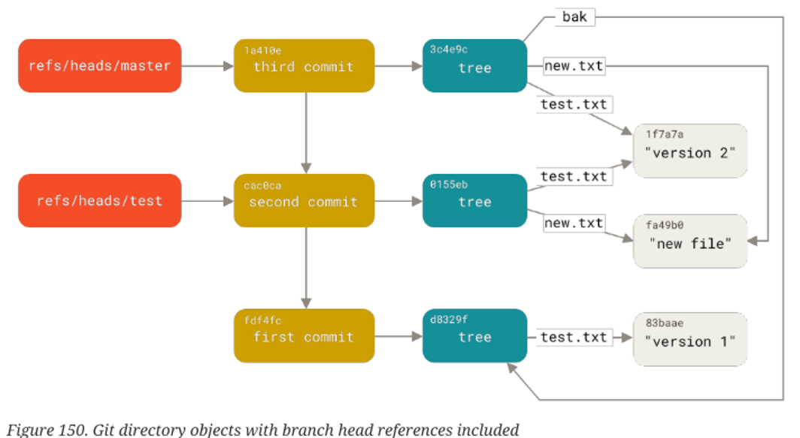

#### Git HEAD

The question now is, when you run _git branch <branch>_, how does Git know the SHA-1 of the 
last commit? The answer is the HEAD file.

Usually the _HEAD_ file is a symbolic reference to the branch you are currently on. By 
symbolic reference, we mean that, unlike a normal reference, it contains a pointer to 
another reference.

However, in some rare cases, the _HEAD_ file may contain the SHA-1 value of a git object. 
This happens when you extract a tag, commit, or remote branch, which puts your repository
in the "HEAD detached" state.

If you look at the file, you will normally see something like this:

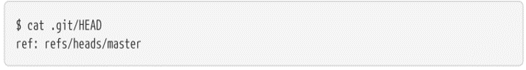

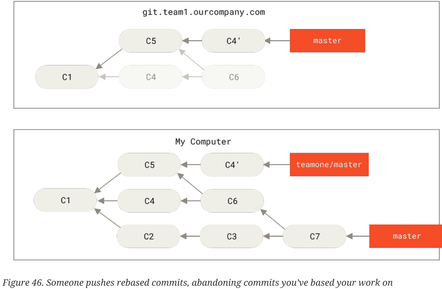

#### Tags

We just finished discussing Git's three main object types (blobs, trees, and commits), but
there is a fourth. The label object is very similar to a commit object: it contains a tagger,
a date, a message, and a pointer. The main difference is that a label object generally 
points to a commit rather than a tree. It's like a branch reference, but it never moves; it
always points to the same commit but gives it a friendlier name.

That's all that a lightweight label is; a reference that never moves. However, an annotated
tag is more complex. If you create an annotated tag, Git creates a tag object and then writes
a reference to point to it instead of directly to commit. You can see this by creating an
annotated tag (using the _-a_ option):

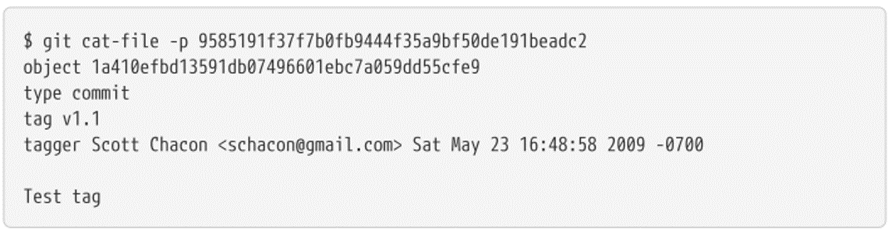

#### Remotes

The third type of referral you will see is a remote referral. If you add a remote and push it,
Git stores the value it last sent to that remote for each branch in the _refs/remotes_ 
directory. For example, you can add an origin called remote and send your master branch to it:

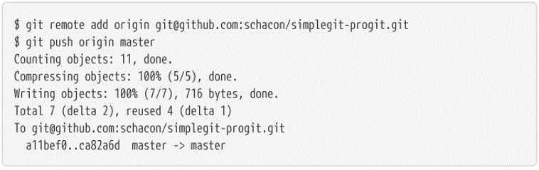

Remote references differs from branches (_ref/heads_ references) mainly in that they are
considered **read-only**. You can _git checkout_ to one, but Git won't symbolically reference 
_HEAD_ to one, so it will never update it with a commit command. Git manages them as bookmarks
to the last known state of where those branches were on those servers.
