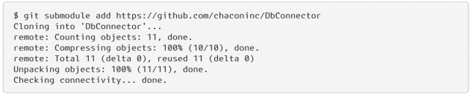

## Git Tools

### Singing your work

Git is cryptographically secure, but not foolproof. If you are taking the work of others 
on the internet, and you want to verify that the commits are actually from a trusted source,
Git has a few ways to sign and verify the work using GPG.

#### GPG Introduction

First, if you want to sign something, you need to configure GPG and install your 
personal key.

If you don't have a key installed, you can generate one with _gpg --gen-key_.

Once you have a private key to log in, you can configure Git to use it to sign things 
by setting the _user.signingkey_ configuration setting.

#### Singing tags

If you have a GPG private key configuration, you can now use it to sign new labels.
All you have to do is use _-s_ instead of _-a_:

If you run _git show_ on that tag, you can see its attached GPG signature:

#### Verifying tags

To verify a signed tag, use _git tag -v <tag-name>_. This command uses GPG to verify the 
signature. **You need the signer's public key** on your keychain for this to work properly:

#### Singing commits

In newer versions of Git (v1.7.9 and higher), you can now also sign individual commits.
If you're interested in signing commits directly instead of just the tags, all you need to 
do is add an _-S_ to your _git commit_ command.

To view and verify these signatures, there is also a _--show-signature_ option for _git log_.

### Submodules

#### Starting with submodules

It often happens that while working on a project, you need to use another project from within.
Perhaps it is a library developed by a third party, or one that you are developing separately 
and used in multiple major projects. A common problem arises in these scenarios: you want 
to be able to treat the two projects as separate and still be able to use one from the other.

Here is an example. Let's say you are developing a website and creating Atom feeds. Instead 
of writing your own Atom build code, you decide to use a library. You will likely have to 
include this code from a shared library, such as a CPAN or Ruby gem installation, or copy
the source code into your own project tree. The problem with including the library is that it
is difficult to customize the library in any way, and it is often more difficult to implement, 
because you have to make sure that each client has that library available. The problem with 
submitting the code to your own project is that any custom changes you make are difficult to
merge when upstream changes are available.

Git addresses this problem by using submodules. Submodules allow you to maintain a Git repository
as a subdirectory of another Git repository. This allows you to clone another repository in your 
project and keep your commits separate.

Let's start by adding an existing Git repository as a sub-module of the repository we are 
working on. To add a new submodule, use the git submodule add command with the absolute or
relative URL of the project you would like to start crawling. In this example, we will add a 
library called "DbConnector".

You should first notice the new _.gitmodules_ file. This is a config file that stores the
mapping between the project url and the local subdirectory you entered it into:

#### Cloning with submodules

Here we will clone a project with a submodule. When you clone such a project, by default you
get the directories that contain submodules, but none of the files within them yet:

The DbConnector directory is there, but empty. You need to run two commands: _git submodule 
init_ to initialize your local config file, and _git submodule update_ to get all the data from 
that project and see the appropriate commit listed in your superproject:

However, there is another way to do this that is a bit simpler. If you pass _--recurse-submodules_
to the git clone command, it will automatically initialize and update every submodule in the
repository, including nested submodules if any of the submodules in the repository have
submodules.

If you already cloned your project and forgot _--recurse-submodules_, you can combine the 
update steps of _git submodule init_ and _git submodule_ by running _git submodule update --init_. 
To also initialize, search, and verify any nested submodules, you can use the foolproof update
of the submodule _git --init --recursive_.

### LFS

#### What is?

Git Large File Storage (LFS) replaces large files such as audio samples, videos, data sets, 
and graphics with text pointers within Git, while storing the file's content on a remote
server such as GitHub.com or GitHub Enterprise.

#### How it works?

Git LFS uses pointers instead of the actual files or binary large objects (blobs). So instead 
of writing large files/blobs to a Git repository, write a pointer file. And the files/blobs
themselves are written to a separate server. You can even use multiple servers on Git LFS.

Getting started is pretty straightforward. Download the extension and configure its file types.

Using Git LFS makes it possible to version large files (and manage blobs) while freeing up 
space in the Git repositories. And Git LFS is usually a solution for submitting large files to
GitHub.

Git LFS stores the contents of the binary file on a custom server or through the built-in LFS
storage of GitHub, GitLab, or BitBucket. To find the location of the binary content, look in 
the _.git/lfs/objects_ folder of your repository.

Git LFS uses a special Git Hook to handle sending your LFS files to the special LFS location. 
Because LFS uses Git filters to handle differences and proper storage, make sure Git Hooks 
can be run on your machine.

LFS reads the SHA stored in Git, then uses it to find the appropriate binary file in the 
_.git/lfs/objects_ folder. If it can't find the file it needs, it tries to download the
file from the LFS server found in the git configuration file in the local repository.

#### How to

1. Download and install the Git command line extension. Once downloaded and installed, 
configure Git LFS for your user account by running:

    **_git lfs install_**

2. For each Git repository where you want to use Git LFS, select the file types you want 
Git LFS to manage (or directly edit their _.gitattributes_). You can configure additional 
file extensions at any time.

    **_git lfs track "\*.psd"_**

    Now make sure the _.gitattributes_ is tracked:
    
    **_git add .gitattributes_**

3. There is no step three. Just confirm and submit to GitHub as you normally would; for example, 
if your current branch is called main:

    **_git add file.psd_**
    
    **_git commit -m "Add design file"_**
    
    **_git push origin main_**